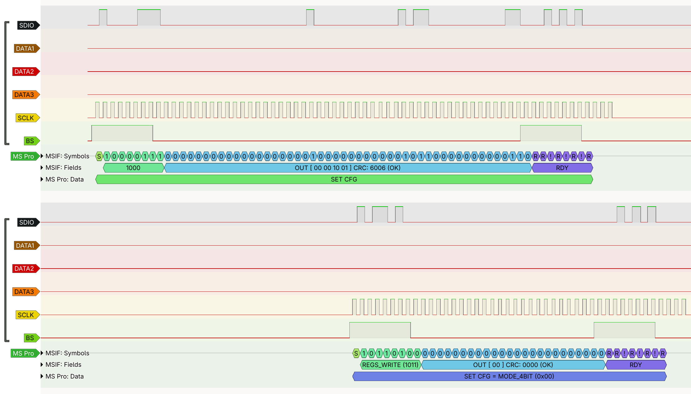

# Memory Stick protocol decoder

Memory Stick protocol decoder for libsigrokdecode. Annotates the low-level protocol symbols (bits/nibbles) of the Memory Stick interface as well as higher-level command/response between a Memory Stick reader and various type of cards.

Requires the typedsigrokdecode module.

## Supported protocol types and features

- Memory Stick Interface
    - Start condition and bus state tracking
    - Protocol symbol annotation
    - CRC validation
- Memory Stick Classic
    - 4-bit mode switching (CFG 0x88)
    - Annotate commands
    - Annotate NAND and OOB data access
- Memory Stick Pro
    - 4-bit mode switching (CFG 0x00)
    - Annotate commands
    - Annotate attribute and user data access through `SET_CMD_EX` and `{READ,WRITE}_LONG_DATA`
    - Annotate PS Vita Memory Card authentication - Incomplete
